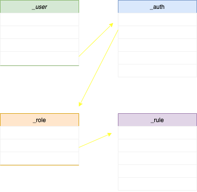
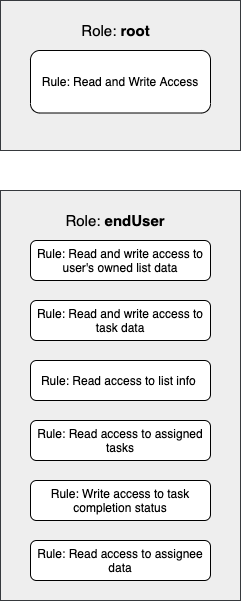

# To-Do List Generator Part Two: Issuing **Authority and Permissions** at the Data layer with Fluree DB

### Recap

This tutorial is a follow up to the first tutorial found [here](https://github.com/fluree/to-do-lists-generator) on the `to-do-list` branch, where we built a to-do list generator using React and Fluree. If you are not familiar with Fluree, please refer to the first part of this tutorial series to learn the basics. We will be building off of the first version by using the `to-dp-V2-auth_and_permissions` branch.

### Fluree

As previously mentioned Fluree is a Web3-capable graph database platform powered by an [immutable ledger](https://docs.flur.ee/guides/1.0.0/intro/what-is-fluree). The [architecture](https://docs.flur.ee/guides/1.0.0/architecture) of Fluree gives developers a lot of freedom and control over the way data is managed, specifically the enabling of permissions that go along with data maintenance. Unlike regular dbs plagued with data-silos and ever changing APIs to manage permissions and identity, Fluree offers the ability to implement them in the data layer.

## Identity and Permissions

To fully understand the way identity and permissions work in Fluree, we will need to dive into the different collections and predicates that help facilitate this capability.

### User, Auth, Rules, and Roles

`_user`, `_auth`, `_rule`, and `_role` are built in collections within Fluree that hold the criteria needed to implement user permissions and control identity. Below is a diagram showcasing how each collection is connected to each other by their predicates.

A user can have an auth record associated with their identity, that auth record is then governed by the roles associated with it. Each specific role has rules that dictate their access (read and write) to the data. The role that comes straight out of the box in Fluree is `["_role/id","root"]`, this role has full read and write access to the db. Users can have multiple roles connected to their auth record, and each role can have different rules as well. Also users can have multiple auth records, but multiple users cannot share the same auth record.

> It is important to note that an auth record does not need to be tied to a user, they can be used independently with a collection of your choosing.

### Generating Auth records with Public-Private Keys

The way auth records control identity in Fluree are by tying the record to a specific public-private key pair. This cryptographic identity enables the user to sign their transactions and queries according to their permissions. There are a number of ways to generate the public-private key/auth id triple, and can be found [here](https://docs.flur.ee/guides/1.0.0/identity/auth-records#generating-a-public-private-keyauth-id-triple) in the docs. In this tutorial we will be issuing them using the Admin UI in the sections below.

> Signing queries and transactions can be done in different ways found [here](https://docs.flur.ee/guides/1.0.0/identity/signatures), in this tutorial we use the `@fluree/crypto-utils` library.

## Integrating identity and permissions into the Application

Now that we have a basic understanding of how identity and permissions can be used within Fluree lets take these concepts and configure them within our application. We will need to refine our schema, add roles and rules, create smart functions, and generate auth records with private-public keys.

### Schema Changes

In the previous version of this application the `_user` collection was not used, but now that we need to leverage permissioning we will utilize the `_user` collection, along with their `username` predicate. The only other additions are the following predicates: `list/listOwner` and `assignee/user` these are both predicates that reference the `_user` collection. The `list/listOwner` predicate references a single user, while the`assignee/user` predicate is `multi: true`, meaning it can reference multiple users, given that a list can have more than one assignee. The entire schema can be found [here](https://github.com/fluree/to-do-lists-generator/blob/to-do-V2-auth_and_permissions/src/data/01-Schema.json).

### Roles and Rules

We have two types of users: list-owners and assignees. In this scenario we do not need to create multiple roles for these users, one role is suitable to control what the different users can see and do. We will create an **endUser** role and utilize the existing **root** role.

Now that we have the root role and our additional endUser role we need to create the rules that will govern what the roles can and cannot do. Below is a graphic with the rules associated with each role.

At first glance it doesn't seem like the root user and the endUser differ in what they can and cannot do, but in order to fully grasp how the rules are enforced we need to dive into [Smart Functions](https://docs.flur.ee/guides/1.0.0/smart-functions/smart-functions). Smart functions are functions written in Clojure, they can be triggered with any query or transaction that a user attached to a certain role issues. These smart functions live in the `fn` collection, the `_rule` collection has a predicate called `fns` which is a reference to this collection. So when an action takes place the smart function that is connected to a certain rule is evaluated and will either return true or false depending if the user in question has the permission to execute the desired action.

