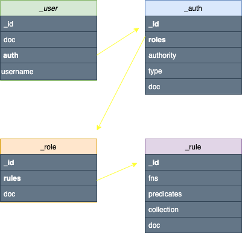
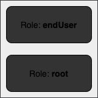

# To-Do List Generator Part Two: Issuing **Identity and Permissions** at the Data layer with Fluree DB

## Recap

This tutorial is a follow up to the first tutorial found [here](https://github.com/fluree/to-do-lists-generator) on the `to-do-list` branch, where we built a to-do list generator using React and Fluree. If you are not familiar with Fluree, please refer to the first part of this tutorial series to learn the basics. We will be building off of the first version by using the `to-do-V2-auth_and_permissions` branch.

## Getting started

1. To get started git clone the repo via `git clone https://github.com/fdmmarshall/to-do-lists-generator.git`, or any other preferred method.

2. `cd` into the repo and run `npm install`

3. then run `npm start` to locally serve the app in your browser at [http://localhost:3000](http://localhost:3000)

> Make sure you check out the `to-do-V2-auth_and_permissions` branch.

## Fluree

As previously mentioned Fluree is a Web3-capable graph database platform powered by an [immutable ledger](https://docs.flur.ee/guides/1.0.0/intro/what-is-fluree). The [architecture](https://docs.flur.ee/guides/1.0.0/architecture) of Fluree gives developers a lot of freedom and control over the way data is managed, specifically the enabling of permissions that go along with data maintenance. Unlike regular dbs, plagued with data-silos and ever changing APIs to manage application-specific permissions and identity, Fluree offers the ability to implement them directly in the data layer.

## Identity and Permissions

To fully understand the way identity and permissions work in Fluree, we will need to dive into the different collections and predicates that help facilitate this capability.

### User, Auth, Rules, and Roles

`_user`, `_auth`, `_rule`, and `_role` are built in collections within Fluree that hold the criteria needed to implement user permissions and control identity. Below is a diagram showcasing how each collection is connected to each other by their predicates.



A user can have an auth record associated with their identity, that auth record is then governed by the roles associated with it. Each specific role has rules that dictate their access (read and write) to the data. The role that comes straight out of the box in Fluree is `["_role/id","root"]`, this role has full read and write access to the db. Users can have multiple roles connected to their auth record, and each role can have a different set of rules as well. Also users can have multiple auth records, but multiple users cannot share the same auth record.

> It is worth noting that an auth record does not need to be tied to a user, they can be used independently with a collection of your choosing.

### Generating Auth records with Public-Private Keys

The way auth records control identity in Fluree are by tying the record to a specific public-private key pair (specifically generated using the [secp256k1 elliptic curve](https://docs.flur.ee/guides/1.0.0/architecture/blockchain#proving-identity)). This cryptographic identity enables the user to sign their transactions and queries according to their permissions. There are a number of ways to generate the public-private key/auth id triple, and can be found [here](https://docs.flur.ee/guides/1.0.0/identity/auth-records#generating-a-public-private-keyauth-id-triple) in the docs. In this tutorial we will be issuing them using the Admin UI in the sections below.

> Signing queries and transactions can be done in different ways found [here](https://docs.flur.ee/guides/1.0.0/identity/signatures), in this tutorial we use the `@fluree/crypto-utils` library.

## Integrating identity and permissions into the Application

Now that we have a basic understanding of how identity and permissions can be used within Fluree lets take these concepts and configure them within our application. We will need to refine our schema, add roles and rules, create smart functions, and generate auth records with private-public keys.

> Make sure to change the network and db variables located in the `appConfig.js` to mirror your Fluree network and db namespace, and double-check that you're using the correct port (e.g. :8090).

### Schema Changes

In the previous version of this application the `_user` collection was not used, but now that we need to leverage permissioning we will utilize the `_user` collection, along with their `username` predicate. The only other additions are the following predicates: `list/listOwner`, `assignee/user`, and `task/issuedBy`, where all of these predicates reference the `_user` collection. The `list/listOwner` predicate references a single user, while the`assignee/user` predicate is `multi: true`, meaning it can reference multiple users, given that a list can have more than one assignee. The entire schema can be found [here](https://github.com/fluree/to-do-lists-generator/blob/to-do-V2-auth_and_permissions/src/data/01-Schema.json)and transacted to a new Fluree ledger.

### Roles and Rules

We have two types of users: list-owners and assignees. In this scenario we do not need to create multiple roles for these users, one role is suitable to control what the different users can see and do. Any difference in how list-owners and assignees can interact with lists and tasks can be permissioned based on how each user is linked to those records in the schema.

We will create an **endUser** role and utilize the existing **root** role.



We can transact our new role to the DB:

```json
[
  {
    "_id": "_role?endUser",
    "id": "endUser"
  }
]
```

Now that we have the root role and our additional endUser role we need to create the rules that will govern what the roles can and cannot do. Below is a graphic with the rules associated with each role.


At first glance it doesn't seem like the root user and the endUser differ in what they can and cannot do, but in order to fully grasp how the rules are enforced we need to dive into [Smart Functions](https://docs.flur.ee/guides/1.0.0/smart-functions/smart-functions). Smart functions are functions written in Clojure\*, they can be triggered with any query or transaction that a user attached to a certain role issues. These smart functions live in the `_fn` collection, the `_rule` collection has a predicate called `_rule/fns` which is a reference to this collection. So when an action takes place the smart function that is connected to a certain rule is evaluated and will either return **true** or **false** depending if the user in question has the permission to execute the desired action.

> \*Currently, Smart Functions are only usable in Clojure, although we are alpha-testing a version of Fluree that allows for JavaScript-written Smart Functions as well. Stay tuned for updates!

### Rules and Smart Functions

It is important to note that smart functions are not limited to use in rules, they can be used in `_collection/spec`, `_predicate/spec`, `_predicate/txSpec` and even in transactions, an example of each can be found [here](https://docs.flur.ee/guides/1.0.0/smart-functions/smart-functions). But for the purpose of demonstrating permissions, all of our smart functions are connected to the rules mentioned above. Now lets create a rule that is connected to a smart function:

```json
[
  {
    "_id": "_rule$fullAccessOwnListData",
    "id": "fullAccessOwnListData",
    "doc": "A _user with this rule can only view and edit their own list data",
    "fns": ["_fn$fullAccessOwnListData"],
    "ops": ["all"],
    "collection": "list",
    "predicates": ["*"]
  },
  {
    "_id": "_fn$fullAccessOwnListData",
    "name": "fullAccessOwnListData?",
    "doc": "A _user can query and edit their own list data",
    "code": "(relationship? (?sid) [\"list/listOwner\" \"_user/auth\"] (?auth_id))"
  }
]
```

The JSON snippet above is an example of a transaction that issues both a [`rule`](https://docs.flur.ee/docs/1.0.0/schema/identity#_rule) and its accompanying [`fn`](https://docs.flur.ee/docs/1.0.0/schema/functions). Starting with the rule object it includes a temporary id (for the transaction) that will evaluate to a integer once it's in Fluree. It also includes an `id`, a `description`, the `fns` associated with the rule in the form of a temporary id, `ops` is set to `all` (meaning this applies to both actions: transact and query), and the collection and its predicates to which this rule is attributed to. In this case it applies to the `list` collection and all of its predicates.

In short, this rule indicates that the `fullAccessOwnListData` smart function will be run every time a user with this rule either transacts or queries any data field available to records in the `list` collection.

The next object is a transaction item that creates the smart function connected to this rule. It uses a temporary id, a name, a description, and the code is in Clojure. Clojure is a Lisp family language developed for the Java Virtual Machine, and is the language Fluree uses to program its core software. For an in-depth look at Clojure's syntax visit [Learn X in Y minutes: Clojure](https://learnxinyminutes.com/docs/clojure/), and useful introduction material can be found at [Clojure for the Brave and True](https://www.braveclojure.com/clojure-for-the-brave-and-true/). Lets break the code down:

```clj
(relationship? (?sid) [\"list/listOwner\" \"_user/auth\"] (?auth_id))
```

There are a [subset of Clojure functions](https://docs.flur.ee/docs/1.0.0/schema/functions#universal-functions-for-_fncode) that can be used in the code, but in this tutorial all of our smart functions use the `relationship?` function. The syntax for the `relationship?` function is as follows `(function startSubject path endSubject)`.

In our implementation, this maps to the following:

- `function`: `relationship?`
- `startSubject`: `(?sid)`
  - `(?sid)` is a [context-dependent function](https://docs.flur.ee/docs/1.0.0/schema/functions#context-dependent-functions) which refers to the specific subject id being queried/transacted in the context of the current function evaluation.
- `path`: `[\"list/listOwner\" \"_user/auth\"]`
  - The `path` can be a single predicate or a vector of predicates that potentially connect the two subjects. Essentially, for the `relationship?` smart function to be satisfied, we use this schema-defined path to evaluate whether a relationship exists between two subjects. In our example, if the data links a list to the user accessing the list, via the path of `list/listOwner`, then we can understand the user accessing the list is the owner and should be entitled to specific permissions.
- `endSubject`: `(?auth_id)`
  - `(?auth_id)` is also a context-dependent function and refers to the specific auth record (i.e. public cryptographic identity) that is querying/transacting against the data at the time of the smart function evaluation.

The whole code evaluates if the relationship between the subject id and the auth record id return true, given the path. In this example in order for a `listOwner` to view their list data, their id must have a connection to the auth record id, via the path `[list/listOwner _user/auth]` that bridges that connection within the data & the schema that models it.

Not all rules may need a custom smart function as the one above, in some cases a user's ability to query and transact certain data should always be true. That means there does not have to be a startSubject or endSubject evaluated through a path. For a rule to always evaluate to true we simply set the `_rule/fns` to `"fns": [[ "_fn/name","true"]]`, the same can be done if a rule must always evaluate to false.

```json
{
  "_id": "_rule$canViewAssignees",
  "id": "canViewAssignees",
  "doc": "A _user with this rule can view all assignee data",
  "fns": [["_fn/name", "true"]],
  "ops": ["query"],
  "collection": "assignee",
  "predicates": ["*"]
}
```

> The transaction above is a rule where all users can view assignee data, so this rule will always evaluate to true.

We won't go over every rule and their smart functions connected to the endUser role, however they can all be found [here](https://github.com/fluree/to-do-lists-generator/blob/to-do-V2-auth_and_permissions/src/data/03-rules.json) and transacted to the Fluree ledger.

### Auth records and public-private keys

Now that the roles and rules are transacted into the ledger it is time we create auth records for our users and connect them to public-private keys in order for us to sign queries and transcation, as well as see it in the app UI.

The sample schema provided [here](https://github.com/fluree/to-do-lists-generator/blob/to-do-V2-auth_and_permissions/src/data/04-Sample-data.json) has users with nested auth records, like the example below:

```json
[
  {
    "_id": "_user$6",
    "username": "rootUser",
    "auth": [
      {
        "_id": "_auth",
        "id": "Tf3VDot4jSKHFcLY8HSPsuf2yA5YBnRsEPU",
        "roles": [["_role/id", "root"]]
      }
    ]
  }
]
```

This auth id is already tied to a public-private key pair, in the sense that it is [derived directly from an secp256k1 public key](https://docs.flur.ee/guides/1.0.0/identity/auth-records#generating-a-public-private-keyauth-id-triple). This auth record just needs to be transacted, along with the rest of the sample data. The gif below shows how to generate an auth record with private-public keys through the admin UI, by selecting _transact_ on the left navigation bar, then pressing the _Generate Keys_ button above the code editor.

<p width="100%" align="center">

</p>

This will prompt a modal to appear with the **Public Key**, **Private Key**, and **Auth Id**. You can either transact the auth record within the modal (remembering to make the approriate role changes if necessary), then connect the auth id to a user in a separate transaction, or you can copy the auth object, and nest it into a user transaction similar to the one above. **But be sure to save the public and private keys externally before closing the modal**. In this tutorial there have six users in our sample data and their public-private keys and auth ids are kept in the [usersAuth.js](https://github.com/fluree/to-do-lists-generator/blob/to-do-V2-auth_and_permissions/src/data/usersAuth.js). Once the sample data is fully transacted, we can now move on to issuing signed queries and transactions.

## Signing Queries and Transactions

The marriage between issuing permissions and generating private-public keys takes place when users sign queries and transactions. The signature proves that whoever is issuing the query or transaction has access to the private key, and so on successful submission it validates their access to view the data or make changes. There are a few ways to go about signing, in this tutorial we use the NPM package, [`@fluree/crypto-utils`](https://github.com/fluree/crypto-utils), but other methods can be found [here](https://docs.flur.ee/guides/1.0.0/identity/signatures).

### Signing Queries

The query below uses the `signQuery` function. It takes a private key, param, queryType, host, and db as parameters (defined below), then it returns an object with keys: `header`, `method` and `body`, which can be sent to the `/query` endpoint (or other possible endpoints such as `/multi-query`, `history`, and `block`). This specific query can be found [here](https://github.com/fluree/to-do-lists-generator/blob/42fd9831f4ee79665dcc266ee915de4278cf91f3/src/ListContext.js#L138), it is triggered on load and defaults to the rootUser on the tab component. Each tab option is a different user with different permissions. The lists view changes given their identity.

```js
import { signQuery } from '@fluree/crypto-utils';
import usersAuth from './data/usersAuth';

const fetchListData = {
  select: [
    '*',
    {
      tasks: [
        '*',
        {
          assignedTo: ['*'],
        },
      ],
    },
  ],
  from: 'list',
  opts: {
    compact: true,
    orderBy: ['ASC', '_id'],
  },
};
const privateKey = selectedUser.privateKey;
const queryType = 'query';
const host = 'localhost';
const db = `${network}/${database}`;
const param = JSON.stringify(fetchListData);
let signed = signQuery(privateKey, param, queryType, host, db);
fetch(`${baseURL}/query`, signed) //fetch issues the request to the given url and takes the output of signedQuery.
  .then((res) => res.json())
  .then((res) => {
    setLists(res);
  })
  .catch((err) => {
    if (/not found/.test(err.message)) {
      return console.log("this didn't work");
    }
  });
```

### Signing Transactions

These are two example transactions, they both use the `signTransaction` function, which takes an auth id, db, expire, fuel, private key, tx, and optional deps. It is similar to the query version, but the output of `signTransaction` is then placed within the body of the POST request. Please refer to [deleteTaskFromFluree](https://github.com/fluree/to-do-lists-generator/blob/cb12b3d11fb5cdb24686713d40c9575822e4744e/src/ListContext.js#L261) and [editTaskProps](https://github.com/fluree/to-do-lists-generator/blob/cb12b3d11fb5cdb24686713d40c9575822e4744e/src/ListContext.js#L309) for their full implementation.

```js
import { signTranaction } from '@fluree/crypto-utils';
import usersAuth from './data/usersAuth';

let deleteTaskFromFluree = () => {
  const privateKey = selectedUser.privateKey;
  const auth = selectedUser.authId;
  const db = `${network}/${database}`;
  const expire = Date.now() + 1000;
  const fuel = 100000;
  const nonce = 1;
  const tx = JSON.stringify([
    {
      _id: chosenTask._id,
      _action: 'delete',
    },
  ]);

  let signedCommandOne = signTransaction(
    auth,
    db,
    expire,
    fuel,
    nonce,
    privateKey,
    tx
  );
  const fetchOpts = {
    method: 'POST',
    headers: { 'Content-Type': 'application/json' },
    body: JSON.stringify(signedCommandOne),
  };

  fetch(`${baseURL}command`, fetchOpts).then((res) => {
    return;
  });
};
```

```js
let editTaskProps = () => {
  const privateKey = selectedUser.privateKey;
  const auth = selectedUser.authId;
  const db = `${network}/${database}`;
  const expire = Date.now() + 1000;
  const fuel = 100000;
  const nonce = 1;
  const tx = JSON.stringify(taskChangeTransact);
  let signedCommandTwo = signTransaction(
    auth,
    db,
    expire,
    fuel,
    nonce,
    privateKey,
    tx
  );

  const fetchOpts = {
    method: 'POST',
    headers: { 'Content-Type': 'application/json' },
    body: JSON.stringify(signedCommandTwo),
  };
  fetch(`${baseURL}command`, fetchOpts).then((res) => {
    return;
  });
};
```

### Wrap up

At its core identity and permissions within Fluree are simply data, but with security in the data layer power and scalability are not at the mercy of firewalls and APIs. It's time to move away from application-centricity and embrace data-centricity.

To learn more about architecture, infrastructure, and identity, visit the Fluree [guides](https://docs.flur.ee/guides/1.0.0/intro/intro) section. And for other repo examples visit our [developer hub](https://github.com/fluree/developer-hub).
